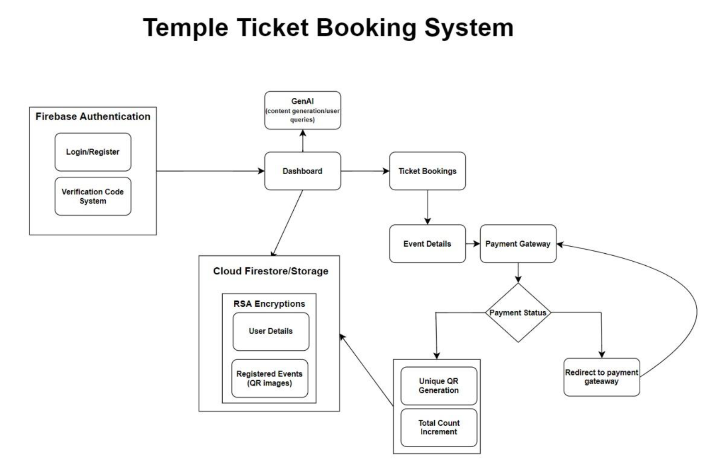

# Temple Ticketing System

## Overview

Welcome to the documentation for the **Temple Ticketing System** app. This repository contains all the necessary code and resources for the temple's ticket booking system, which simplifies visitor management. This system provides a seamless experience for ticket booking, real-time visitor count updates, waiting time notifications, and QR code generation for ticket validation. Additionally, we integrate **blockchain technology** for secure and transparent transaction records.

## Problem Statement

Design a modern ticketing system to streamline visitor management at the Temple. The system includes features like:

- Online ticket booking
- Real-time updates on visitor count
- Waiting time notifications
- QR code generation for tickets
- Blockchain integration for secure and transparent transaction records

## Purpose

The **Temple Ticketing System** aims to improve the visitor experience by offering quick and easy ticket booking, real-time visitor count tracking, waiting time alerts, and ticket validation using QR codes. With the integration of blockchain technology and cryptographic encryption, the system ensures safe, transparent, and secure transactions.

## Objectives

- Provide visitors with a convenient and hassle-free ticket purchase experience.
- Enable temple managers to access real-time data on visitor volume and income production.
- Enhance security in ticket transactions using cryptographic encryption.

## System Architecture

### Overview

The architecture of the **Temple Ticketing System** consists of several interconnected components designed to ensure smooth communication between various parts, offering effective visitor management, secure transaction processing, and reliable ticket booking.

### Workflow

The system is made up of the following components:

#### Frontend Application (Flutter)

The frontend is developed using **Dart** and the **Flutter** framework, providing a cross-platform mobile application for visitors to interact with the ticketing system. Key functionalities include ticket booking, QR code generation, and real-time visitor count updates.

#### Backend (Firebase)

The backend is powered by **Firebase**, a cloud-based platform providing real-time database access, authentication, and cloud functionalities. Firebase manages ticket bookings, user authentication, and real-time data synchronization between the database and the frontend application.

#### Blockchain Network

The blockchain network keeps a tamper-proof and immutable record of all ticket transactions, ensuring transparency and security. The frontend and backend components interact with the blockchain via smart contracts, ensuring secure and validated transactions.

## Feature Integration

### 1. Online Ticket Booking
- Users can book tickets using the Flutter frontend, while Firebase handles data storage and user authentication.
- Cloud Firestore Database and Firebase Authentication are used for secure user data management.

### 2. Real-time Updates
- Firebase’s Firestore Database continuously monitors visitor counts and waiting times, providing real-time updates to the frontend.

### 3. QR Code Generation
- Upon successful booking, the frontend generates a unique QR code linked to the transaction ID stored in Firestore, serving as the digital ticket.

### 4. Blockchain Integration
- Every transaction is recorded on the blockchain network, ensuring secure, immutable, and transparent transaction records.
- QR codes are cross-checked against the blockchain to verify ticket authenticity.

## Current Status

### Development Progress

- The frontend application is nearing completion, with key features like real-time visitor counts, QR code generation, ticket booking, and payment gateways successfully implemented and tested.
- The frontend is integrated with Firebase for real-time data updates and ticket booking. User authentication is the next task to be implemented.

### Ongoing Activities

- **User Integration**: Working on smooth login and registration procedures, implementing secure authentication techniques, and incorporating user profiles.
- **Blockchain & Cryptography Integration**: Blockchain integration is underway to ensure secure and transparent ticket transactions. We have developed a prototype for **RSA Encryption** to secure user data and transactions.

### Future Milestones

1. **Chatbot Integration for Customer Support**
   - Add a chatbot to provide instant support and answer frequently asked questions, assist with ticket-related inquiries, and inform users about temple activities.
   - The chatbot will use **machine learning** and **natural language processing (NLP)** to enhance its response capabilities.

2. **Blockchain Integration for Secure Transactions**
   - Finalize the integration of blockchain technology to store ticket transactions in a secure, immutable ledger.
   - Implement cryptographic methods and **smart contracts** to ensure transaction security and prevent fraud.

3. **Admin Login for Real-time Data Updates**
   - Create an admin login to provide temple managers with access to real-time data and insights, such as ticket sales and visitor counts.
   - Implement **Role-based access control (RBAC)** to restrict access to sensitive data.

## Conclusion

The **Temple Ticketing System** transforms the temple's ticketing and visitor management processes. It provides a smooth user experience with features like secure transactions, real-time updates, and ticket booking. Technologies like **Flutter**, **Firebase**, and **blockchain** ensure efficiency and security. Future enhancements, such as an admin login and a customer support chatbot, will further improve functionality and user engagement. Overall, the app optimizes temple operations and enhances the visitor experience.

## Demo Video

[Click here to watch the demonstration video](https://www.youtube.com/watch?v=Coyokgha3YI)

